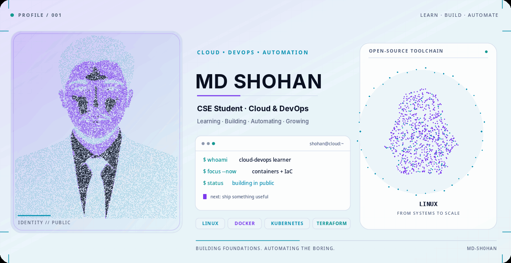

<picture>
  <source media="(prefers-color-scheme: dark)" srcset="./dark.gif">
  <source media="(prefers-color-scheme: light)" srcset="./light.gif">
  
</picture>

# MD-SHOHAN
Personal GitHub Profile Showcasing My Engineering Learning Journey, Projects, And Technologies.
## 👋 About Me

Hi, I'm **MD SHOHAN**, a Computer Science & Engineering student at Bangladesh University with a strong interest in **Cloud Computing and DevOps**.

I'm learning how to build, deploy, automate, and manage reliable infrastructure through practical projects and continuous learning.

- 🎓 Studying Computer Science & Engineering
- ☁️ Interested in Cloud Computing, DevOps, and infrastructure automation
- 🐧 Exploring Linux, containers, orchestration, and CI/CD workflows
- 🛠️ Learning by experimenting, building projects, and documenting my progress
- 🎯 Goal: develop practical skills and build useful, reliable systems

## 🧰 Technologies I'm Exploring

**Operating Systems & Development Environment**

`Linux` · `Ubuntu` · `WSL` · `Visual Studio Code` · `Git` · `GitHub CLI`

**Cloud & Infrastructure as Code**

`AWS` · `AWS CLI` · `Terraform` · `Ansible`

**Containers & Orchestration**

`Docker` · `Docker Compose` · `Kubernetes` · `kubectl` · `Helm` · `kind` · `GHCR`

**Automation, Networking & Security Tools**

`GitHub Actions` · `NGINX` · `OpenSSH` · `OpenSSL` · `TLS/HTTPS` · `MinIO`

## 🌱 Current Focus

- Strengthening my Linux and command-line skills
- Practicing containerization with Docker and Kubernetes
- Exploring infrastructure provisioning with Terraform
- Learning CI/CD automation with GitHub Actions
- Building hands-on Cloud and DevOps projects

---

💡 *Learning · Building · Automating · Growing*
