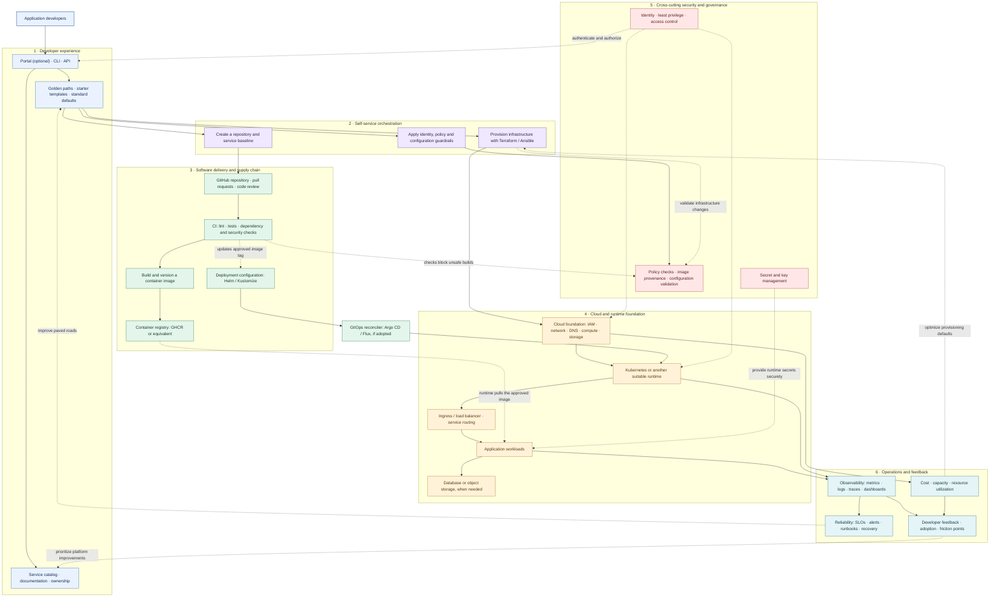
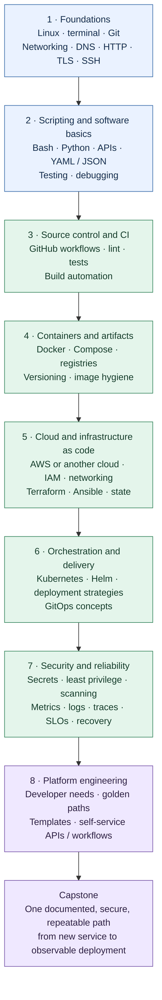

# From Beginner to Platform Engineering

A practical learning path and a target architecture for a small, evolving Internal Developer Platform (IDP). This is a **reference design**, not a claim that every component is already implemented. Keep only the components that your project actually uses as you build it.

## 1. Reference architecture: an Internal Developer Platform

### How to read it

- **Developers consume the platform** through a portal, CLI, API, or documented workflow. A portal is optional; self-service can start with templates and automation.
- **Golden paths standardize common work**—for example, starting a service, creating a repository, running checks, and deploying safely.
- **CI builds and validates artifacts**, while the deployment process promotes a known image version into the runtime environment.
- **Infrastructure automation provisions the foundation**. A GitOps controller is optional and should only be shown as implemented when the project uses one.
- **Security and operations are cross-cutting capabilities**, not final steps. Feedback, reliability, cost and developer experience should influence how the platform evolves.

## 2. The learning path: fundamentals to platform engineering

This is a guide, not a rigid ladder. Build small projects at each stage and revisit earlier skills whenever a project requires them.

## 3. Suggested first capstone

Start small. Create a minimal application and make one supported path that can:

1. Create a repository from a documented template.
2. Run formatting, linting, tests, and appropriate security checks in CI.
3. Build and publish a versioned container image.
4. Provision only the infrastructure needed for the demo.
5. Deploy the selected image using a documented, repeatable process.
6. Expose health checks and basic logs/metrics, with a short runbook.
7. Document rollback, teardown, costs and known limitations.

Only add a portal, a GitOps controller, policy engine, or Kubernetes if it solves a real problem for the capstone. For a learning project, a reliable small golden path is better than a large diagram full of tools you have not used.

## References

- [GitHub Docs: Creating diagrams](https://docs.github.com/en/get-started/writing-on-github/working-with-advanced-formatting/creating-diagrams)
- [CNCF: What is Platform Engineering?](https://www.cncf.io/blog/2025/11/19/what-is-platform-engineering/)
- [CNCF: Internal developer platform vs. internal developer portal vs. PaaS](https://www.cncf.io/blog/2023/12/08/internal-developer-platform-vs-internal-developer-portal-vs-paas/)
